# Control de versiones con Git

[Ver diapositivas](https://rafacabeza.github.io/migit/)


## SCV o Sistema de Control de versiones

Tomado del siguiente [Manual GIT](https://git-scm.com/book/es/v2) en [https://git-scm.com/book/es/v2](https://git-scm.com/book/es/v2):

_Un control de versiones es un sistema que registra los cambios realizados en un archivo o conjunto de archivos a lo largo del tiempo, 
de modo que puedas recuperar versiones específicas más adelante._


## SCV  centralizados

- El enfoque tradicional de los SCV es el de un sistema centralizado. 
- Es el caso de los muy utilizados CVS O Subversion. 
- Esto es fácil de administrar pero obliga a que el servidor siempre esté disponible.


## SCV  distribuidos

- Git, como Mercurial, Bazaar o Darcs, es un sistema distribuido. 
- Los clientes mantienen una copia completa de todo el repositorio.  
- Esto permite hacer cambios sin estar conectados. 
- En algún momento deben sincronizarse los clientes y el servidor o serviodres.


## Git
- Linux usaba BitKeeper para su desarrollo pero en 2005 dejó de ofrecer una licencia gratis para el proyecto GNU/Linux.
- Git se creó para sustituir a BitKeeper
- Linus Torvaldas, creador de Linux, desarrolló Git para dar soporte al desarrollo de este SO.


### Las características de git:

* Es distribuido
* Sencillo y rápido
* Permite grandes proyectos con mulititud de ramas
* Usa copias completas. Hace copia de los ficheros modificados y enlaces a los no modificados.
* Asegura la integridad. Realiza un hash SHA-1 a cada fichero. Si un fichero es alterado git lo detecta.
* La mayoría de cambios se hacen localmente.


### Esquema de almacenamiento

- Cada instantánea se identifica por un _hash_ SHA1
- Cada instantánea o _commit_ añade los ficheros modificados. Y guarda enlaces al resto.

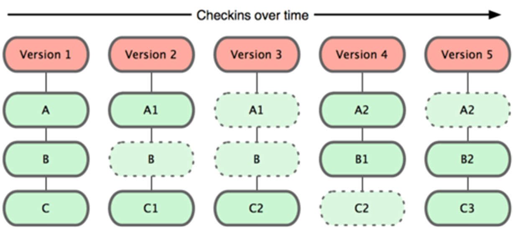


## Instalación
* Vamos a usar Ubuntu o alguna de sus variantes (Mint, Lubuntu, ...)
* Instalación de git:

  ```
  sudo apt-get update

  sudo apt-get install git
  ``` 
* En Windows, descargamos desde [aquí](https://git-scm.com/download/win) y ejecutamos.


## Configuración inicial

* Configuración necesaria para cada commit que haga:

  ```
  git config --global user.name "Your Name"

  git config --global user.email "youremail@domain.com"
  ```

* Opcionalmente el editor \(si no me gusta el que hay por defecto\):

  ```
  git config --global core.editor vi
  ```


## Niveles de configuración de git

Todo lo aquí contado puede verse con más detalle en el citado manual.

* Git tiene 3 niveles de configuración, cada nivel sobreescribe el anterior:

  * Para todos los usuarios: _/etc/gitconfig_

  * Para un usuario: _~/.gitconfig_ \(opción --global\)

  * Para un repositorio: _.git/config_


* Para ver los parámetros configurados:

```
git config --list
```

* Viene bien tener una [chuleta de comandos de Git](https://services.github.com/kit/downloads/github-git-cheat-sheet.pdf)


### GitHub \(o Bitbucket\)
- Git puede usarse localmente y sin conectarse a ningún otro equipo.
- No obstante el uso de un servidor remoto:
    - Facilita la compartición de código
    - Facilita el trabajo en equipo
    - Aumenta la seguridad de nuestro código.


### Uso de GitHub o Bitbucket
* Nos registramos en [Github](https://github.com/) o [Bitbucket](https://bitbucket.org)
* La comunicación entre un repositorio local y uno remoto puede ser mediante https o ssh.
* Por cuestiones prácticas consideramos mejor usar ssh. Veamos que configuración requiere.


#### Configuración de ssh
* Evitaremos introducir usuario/contraseña en nuestra consola
* Accedemos a nuestra cuenta
* Vamos a los settings del __USUARIO__ y asociamos una ssh-key
* Como creamos nuestra ssh-key:

```
ssh-keygen
```

* Copiaremos el contenido de  `~/.ssh/id\_rsa.pub`  a una nueva clave ssh en GitHub


# Iniciar repositorio
## Para empezar.

- Podemos iniciar el repositorio en GitHub o Bitbucket
- Podemos iniciarlo localmente.
- Supongamos que hemos iniciado nuestro proyecto y tomamos la segunda opción.


## Objetivo
- Tomar una carpeta como nuestro repositorio.
- Puede ser la carpeta de ejercicicios de programación.
- Puede ser la carpeta de un proyecto concreto.


### ¿Qué hago localmente?
- Voy a git bash y me muevo a mi directorio
- Tecleo lo siguiente:
	- git init
	- echo "# Repositorio de ejemplo" >> README.md
	- git add README.md
	- git commit -m "Commit inicial"
	
### ¿Qué hago en GitHub/Bitbucket?

- Creo repositorio
- Sigo las instrucciones para subir mi repositorio local:


## Opción B. Iniciar el repositorio en GitHub/Bitbucket

- Al crear el repositorio se da la posibilidad de añadir un fichero README.md y crear un commit inicial.
- Por otra parte podemos partir de un repositorio nuestro o ajeno ya creado.
- En tal caso basta con hacer:

    ```
    git clone <url repo>           #habitual
    git clone <url repo> <carpeta> #permite definir destino
    ```


## Uso de git: guardar cambios
Todas estas operaciones son locales:
- No es necesario salir a la red
- Velocidad muy alta de las operaciones
- Lee de tu base de datos local
- Calcula diferencias entre ficheros en local
- No limita el trabajo sin conexión


### Ver el estado
- Consultar el estado del repositorio: `git status`
- Nos dirá qué ficheros hay nuevos o modificados
- La rama que estamos, por defecto master
- Si estamos por detrás/delante del _origin_, el repositorio remoto

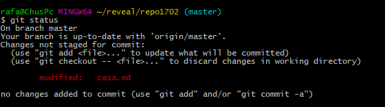


### Preparar y comprometer cambios:

- Con `git add ...` pasamos los ficheros modificados/nuevos a preparados.
- Tras hacer esto se guarda temporalmente los cambios realizados.
- Con `git commit -m "...." comprometemos los cambios.

```
git add .
git commit -m "comentario explicativo"
```

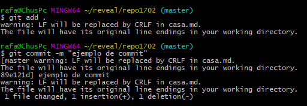


#### Ejemplos de  `git add`

```
git add <nombre fichero>    #un sólo fichero
git add img/logo.jpg
git add <nombre directorio> #todo lo de un directorio
git add .                   #caso particular, todo, todo...
git add public/js
```


#### Recorrido completo:


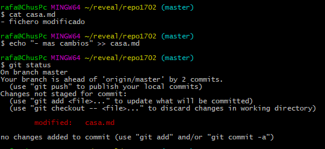
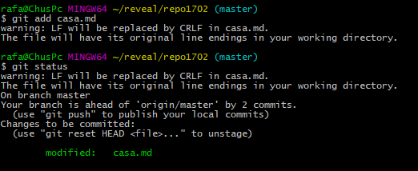


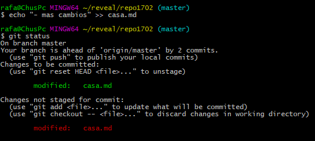
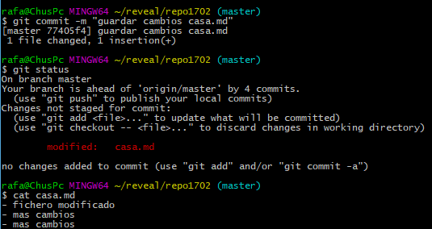


#### Marcha atrás de un fichero modificado

- Hemos modificado un fichero y queremos recuperar la anterior versión:


```
git checkout <nombrefichero>
git checkout casa.md
git checkout <nombre directorio>
git checkout .
```


#### Marcha atrás de un fichero preparado

- Queremos sacar del estado preparado después de `git add`:


```
git reset HEAD <nombrefichero>
git reset HEAD casa.md
git reset HEAD <nombre directorio>
git reset HEAD .
```


### Guardar en remoto.
- En local por defecto trabajamos en la rama master.
- Si hay un remoto, además se guarda oculta la rama origin/master.
- Sean los equipos A y B, y mismo repositorio:

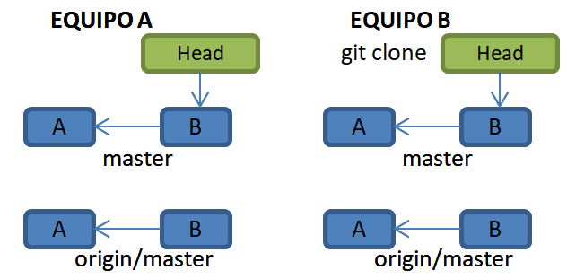


#### Commit + push, equipo A

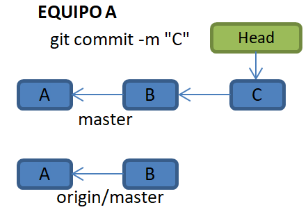


#### Git push
- Push es el comando usado para subir código a _origin_, es decir
el repositorio remoto.
- Origin es el nombre usado por defecto para la copia remota.
- Ejemplos de uso

```
git push                        # sube rama "preferida"

# comando usado en la subida inicial tras git init. Lo explicaremos
git push -u origin master       
```


#### Fetch + pull, equipo B
- Se recomienda hacer git status entre ambos.
- En realidad pull es la suma de dos comandos: fetch + merge

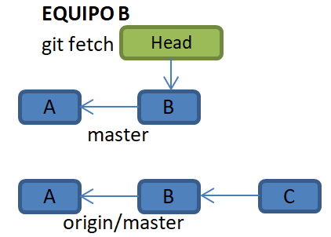
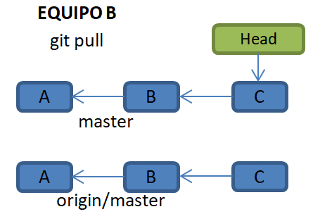


### ¿Cómo usar dos equipos: aula y casa?

- Al empezar a trabajar, ejecutar
```
git fetch
git status
git pull
```
- Al acabar la sesión de trabajo
```
git commit 
git status
git push
```


### Fork & Pull Request
#### Fork
- Clon de un repositorio ajeno en nuestro espacio
- Es una funcionalidad de GitHub/Bitbucket
- P.ej. el repositorio repo1702
- El clon es de mi propiedad y lo puedo clonar 
y editar
#### Pull Request
- Es una solicitud de que el dueño original 
incorpore mis cambios.
- Se hace en la interfaz web
- El dueño original lo acepta o no...


### Commit --amend
- Consiste en rectificar el commit anterior
- Los cambios añadidos sobreescriben el último
commit
- OJO! Puede ser peligroso.


## Ramas (branch)
- Por defecto trabajamos en la rama `master`
- Las ramas se usan fundamentalmente para separar tareas sin
modificar la rama `master`
- Una vez terminada la tarea se funde (merge) la rama de tarea 
con la rama master.
- Esto permite cambiar de rama/tarea y dejarla incompleta sin
dejar el proyecto en versiones incompletas o inestables.


### Comandos con ramas
```
git branch              // lista de ramas
git branch  <rama>      // crear rama
git checkout <rama>     // cambiar de rama
git checkout -b <rama>  // crear y cambiar rama 2 en 1
git branch -d <rama>    // borrar rama
```
### Fundir ramas
```
git checkout master     // nos ponemos en rama master
git merge <rama>        //fundimos con la rama deseada
```


### Revisemos el uso de push 
- Push sube código a un repositorio remoto
- Origin es el alias usado pra el repositorio remoto
- Podríamos usar más de un remoto
- Master es el nombre de la rama por defecto
```
git push                        # sube rama "preferida"
git push <repo remoto> <rama>   # sube una rama concreta
git push origin dev             # Ej. sube rama dev
git push -u <repo remoto> <rama># sube y predetermina rama
git push -u origin master       # Ej. sube y pred. master
```


### Ramas remotas
- Si queremos compartir una rama de trabajo
- Subir una rama:
```
git push origin <rama>
```
- Bajar la rama tiene dos partes:
```
git fetch  #crea la rama oculta origin/<rama>
```
- Las siguientes ordenes son idénticas.
- Ambas crear la rama local <rama> asociada a origin/<rama> 
- La primera nos permite alterar el nombre <rama>.
```
git checkout -b <rama> origin/<rama>
git checkout --track origin/<rama>
```


## Revisando código
- Los comandos básicos son log y diff
- `git log` nos muestra información histórica
- `git diff` compara el contenido de los ficheros


### log
- Log soporta una gran cantidad de parámetros:
- Veámoslo con ejemplos:
```
git log             #uso base
git log -<n>        #log de los últimos n commits
git log --oneline -5 #lista de commits breve
```


### diff

- Git diff sirve para ver las diferencias entre el estado actual y otro:

```
git diff   # diferencia entre estado actual y el preparado o comprometido
git diff --cached #diferencia entre el preparado y el último commit
git diff --stat #idem al primero pero con información resumida de cambios
```


### diff desde un commit concreto

- Podemos hacer diff sobre todo el repo o sobre un fichero.
- Podemos referirnos a un commit por su hash o contando hacia atrás desde el HEAD o desde una rama.
```
git diff <commit> # cambios desde un commit hasta la actualidad
git diff <commit> <file># idem fichero concreto
git diff master~2 README.md #Cambios en los dos últimos commit de master
git diff HEAD~2 README.md #Cambios en los dos últimos commit HEAD
git diff cd598e4 README.md #Cambios desde un commit concreto por hash
```


### diff entre dos commit

```
git diff <commit>:<file>  <commit2>:<file> #diff de un fichero entre dos commits
git diff cd598e4:README.md  31422ac:README.md
git diff master~20:README.md  master~1:README.md
```


## GitIgnorando cosas: .gitignore

- Podemos decir a git que no tenga en consideración algunos ficheros/directorios
- Para hacerlo debemos crear un fichero `.gitignore` en el directorio raiz
- Para ver algunos ejemplos puedes visitar https://www.atlassian.com/git/tutorials/gitignorenuevo
